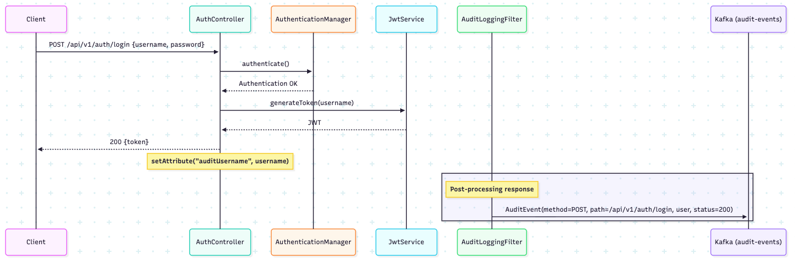
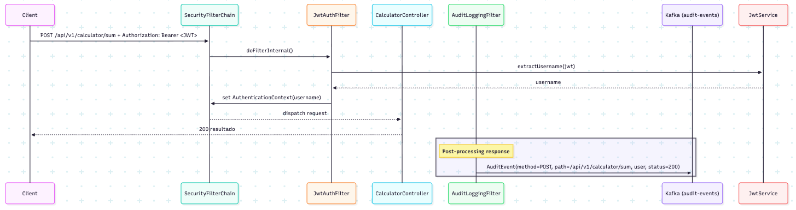

# Spring Boot API

Aplicación Spring Boot con JPA, Security y PostgreSQL.

## Requisitos

- Java 17+
- Maven 3.9+
- Docker

## Configuración

- Antes que nada clonar el repositorio

```bash
git clone https://github.com/duartegaston/desafio-upay.git
```

Este repositorio NO versiona `src/main/resources/application.properties`. En su lugar incluye una plantilla por si queremos levantar localmente:

- `src/main/resources/application.properties.example`

## Ejecutar con Docker (API + Postgres)

1) Build y levantar
```bash
docker compose up --build
```

2) Parar
```bash
docker compose down
```

3) Limpiar datos (elimina el volumen de Postgres)
```bash
docker compose down -v
```

## Endpoints principales

- Collection de Postman: `src/main/docs/postman/desafio-upay.postman_collection.json`
  - Descargarla y probar fácilmente.

- Swagger UI: http://localhost:8080/swagger-ui.html
- OpenAPI JSON: http://localhost:8080/api-docs

- Auth
  - `POST /api/v1/auth/signup` (Crear un usuario)
  - `POST /api/v1/auth/login` (Hacer login para generar un token)

- Cálculos
  - `POST /api/v1/calculator/sum` (requiere Bearer)

- Auditoría
  - `GET /api/v1/audit/history` (requiere Bearer)

## Estructura del proyecto

```
src/main/java/com/example/api/
├─ docs/               # Documentación
├─ resources/          # Recursos
├── config/           # Seguridad y configuración
├── controller/       # REST controllers
├── dto/              # Data Transfer Objects
├── exception/        # Excepciones personalizadas
├── kafka/            # Kafka
├── model/            # Entidades JPA
├── repository/       # Repositorios Spring Data
├── security/         # Filtros y servicios JWT
├── service/          # Lógica de negocio
└── SpringBootApiApplication.java
src/test/java/com/example/api/ # Tests
```

- Utilicé una estructura de capas Controller, Service y Repository, considerando que se trata de una API pequeña, y es mas facil entenderlo separando bien las responsabilidades.
- Utilicé JPA/Hibernate para definir interfaces y contratos de los repositorios.
- Utilicé Spring Data JPA para implementar los repositorios.
- Utilicé Lombok para simplificar el código.
- Utilicé Spring Security para implementar la seguridad.
- Utilicé Docker compose para levantar la API y la base de datos.
- Utilicé Dockerfile para crear la imagen de la API.

## Base de datos

- Contendrá una tabla para persistir los usuarios y otra tabla para persistir los logs de auditoría.

## Kafka

- La API publica eventos de auditoría a un topic de Kafka (audit-events).
- El consumer persiste los eventos en la base de datos.
- Agregué un log para poder verificar que se consumió el evento. "[Kafka][AuditEventConsumer] Consumed event: ..."

## Métricas

- Para consultar métricas se utilizó Prometheus.
  - Endpoint: http://localhost:8080/actuator/prometheus
  - `http_server_requests_seconds_max`: máximo tiempo de respuesta
  - `http_server_requests_seconds`: latencia de las peticiones
  - `http_server_requests_seconds_count`: cantidad de peticiones

## Unit test

- Se agregaron unit tests para los endpoints principales. Para ejecutarlos: 
```bash
export JAVA_HOME=$(/usr/libexec/java_home -v 17)
mvn -q -DskipTests=false test
mvn test
```
- `AuthControllerTest`: 
  - Test login esperando el token.
  - Test creación de usuario

- `JwtAuthFilterTest`
  - Verificamos que se aplique la autenticación.
  - Si no tenemos username no se aplica la autenticación.

- `AuditLoggingFilterTest`
  - Verificación de que el productor envía el evento para auditoría.
  - Si no corresponde el path no se envía el evento para auditoría.

- `JwtServiceTest`
  - Verificación de que se genere el token y se extraiga el username.

- `AuditServiceTest`
  - Verificación de que se hace la búsqueda en el repositorio de auditoría con los datos correctos.

## Consideraciones | Decisiones técnicas

- Respecto al desarrollo del endpoint **POST /api/v1/auth/logout**:
  - El backend no mantiene sesiones ya que los JWT son stateless, por lo que no es necesario implementar logout.
  - Pienso que debería ocurrir en el cliente; por ejemplo, limpiar el localStorage o sessionStorage.
  - Si quisiéramos implementar logout, deberíamos mantener un registro de los tokens emitidos y revocarlos cuando el usuario se desloguea.

- Para la sección de auditoría agregué la posibilidad de filtrar por distintos campos, además de agregar paginación y ordenar por fecha de creación descendente. Este flujo decidí no persistirlo como auditoría ya que no es relevante para el negocio. Los unicos endpoints que se van a auditar son los de autenticación y los de cálculos.

- Posibles mejoras:
   - Si esta arquitectura escalara, utilizaría un sistema de roles para los usuarios para mayor seguridad y controlar acceso a los endpoints. (User, Admin).
   - Agregar logs para detectar errores ya sea por CloudWatch, Kibana o similar.


## Diagramas

### Diagrama de secuencia del Login



### Diagrama de secuencia request autenticada (+ auditoría)


